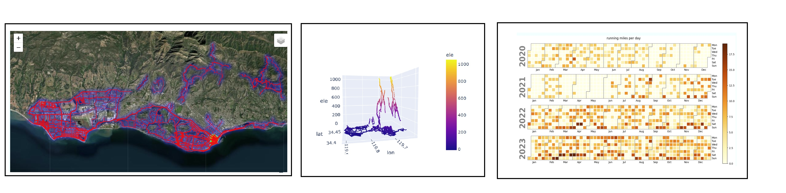

# Instructions to create maps of your running and biking activities (from Garmin Connect or Strava)

See the following [map outputs in interactive form](https://laurensharwood.github.io/) (Left to Right):     
   i) Running route heatmap (interactive)  
   ii) 3D running routes (interactive)  
   iii) Heatmap calendar / GitHub contributions profile of daily running miles (static)  



## To use activity_maps:   
1. Download code: On this page, select the green ```<> Code``` button > ```Download ZIP```
2. Unzip: In file explorer, right-click the downloaded ```activity_maps-main.zip```  > ```Extract All```
3. Fill out only <b><ins>User Input</ins></b>  of ```activity_maps-main/params.csv``` table below  
    * *For the i) and ii) map bounds parameters below: use [geojson.io](https://geojson.io/#map=7.4/34.494/-119.69) or [Google Maps](https://www.google.com/maps/@34.5545511,-119.8579212,59151m/data=!3m1!1e3?entry=ttu) to find longitude (X) / latitude (Y) coordinate points where you've logged activities (within User Input Number or Days)*    


| Parameter | User Input |  Data Type | Description |  Output Filenames |
|  --- | ---| ---- |---- |---- |
| Number of days <br> <ins>or</ins> <br> Strava archive directory | <b>10</b> | integer <br> <ins>or</ins> <br> text |  the number of days before today to download Garmin activities for <br> <ins>or</ins><br>  the directory of  your Strava archive with .gpx files  |   | 
| i) Route heatmap bounds | <b>N/A</b> |  comma-separated float  (decimal degrees) <br> <ins>or</ins> <br> text | [X-min, X-max, Y-min, Y-max] to bound route heatmap (in decimal degrees)<br>   <ins>or</ins><br>  'N/A' to create map from all files |  ```maps/HeatMap_runs.html``` <br> ```maps/HeatMap_bikes.html``` <br> ```maps/HeatMap_run_bike.html```  	| 
| ii) 3D map bounds | <b> -119.98, -119.5, 34.3, 34.6 </b> | comma-separated float (decimal degrees) |  near-square shape [X-min, X-max, Y-min, Y-max] to bound 3D map  *cannot be empty -- to ensure square bounds | ```maps/Route3D_runs.html``` <br>```maps/Route3D_bikes.html```  | 
| iii) Heatmap calendar stat(s) | <b>distance, ascent</b> | comma-separated text | activity statistic sum per day | ```maps/HeatCal_runs_distance.png``` <br> ```maps/HeatCal_bikes_distance.png``` <br>  ```maps/HeatCal_runs_ascent.png``` <br>  ```maps/HeatCal_bikes_ascent.png```  | 
| Map directory  |	<b>```maps```</b> | text  | directory where .png and .html map outputs are saved (created if it doesn't exist) | | 
| Archive directory | <b>```garmin_archive```</b> | text  | directory where .gpx, .tcx, and .csv files are saved (created if it doesn't exist) |	| 

To <b>download Strava archive</b> if you don't know your Garmin Connect email + password and/or log your activities through the Strava app:  
* Login (via web browser): Select the ```Profile```  dropdown (your profile picture) in the upper-right corner > ```Settings```
*  ```My Account``` in the panel on the left: Scroll down to Download or Delete Your Account, select ```Get Started```
* Under 2) Download Request (optional): Select ```Request your Archive```
* When you receive an email from Strava, download & unzip the folder, then copy its filepath & paste it into the first parameter in ```params.csv``` above.   


### See instructions below to run on the <ins>CLOUD</ins> (Google Colab compute and Google Drive storage) <ins>or</ins> your <ins>LOCAL</ins> machine using a [virtual environment](https://laurensharwood.github.io/geospatial-toolbook/tlbook_6_programming.html#virtual-environments).  

*Notice a mistake? [LMK](https://github.com/laurensharwood/activity_maps/issues/new)*

---

### CLOUD 

Files used: ```activities.ipynb```, ```activities.py```, and ```params.csv``` must be in the same folder.   

```activities.ipynb``` executes ```activities.py```, which reads <ins><b>User Input</ins></b> parameters from ```params.csv``` to download running and biking activities and create maps from them.   
Note: *Make sure you have plenty of storage available in My Drive to download .tcx and .gpx files for however many days you specify in ```params.csv```.*

#### STEPS:
4. Upload unzipped ```activity_maps-main``` directory to your Google Drive account, My Drive    
5. To open ```activities.ipynb``` in Google Drive: double-click ```MyDrive/activity_maps-main/activities.ipynb```   
6. Run all cells: In the toolbar, select the Runtime dropdown > Run all    
7. <b>Enter your <ins>Garmin login email & password</ins> when prompted</b> in code/executable cell #2

---

### LOCAL

Files used: ```activities.sh```, ```activities.py```, and ```params.csv``` must be in the same folder.   

```activities.sh```  is called by cron-- which has lines to activate a [virtual environment](https://laurensharwood.github.io/geospatial-toolbook/tlbook_6_programming.html#virtual-environments) (venv) with necessary packages installed, then execute ```activities.py``` from that active venv. ```activities.py``` reads <ins><b>User Input</ins></b> parameters from ```params.csv``` to download running and biking activities. If new activity files are downloaded, they're added to the archive posgreSQL database and new maps are created using the new complete archive.     

#### SETUP: DO ONCE
Create a postgreSQL archive database (instead of saving as a .csv) and set a cron schedule (preinstalled on Mac or Linux) to automatically create maps. 

4. Set execute permissions for activities.sh and activities.py:     
*On Windows—*   
*On a Mac or Linux—* Enter the following commands in a terminal:    
~~~
chmod +x activities.py
chmod +x activities.sh
~~~

5. Save Garmin login credentials:     
*On Windows—* [Set environment variables](https://phoenixnap.com/kb/windows-set-environment-variable)   
*On a Mac or Linux—* Enter the following commands in a terminal, substituting your information between the brackets { } after ```=```:   
~~~
export GARMIN_EMAIL={your garmin username/email} 
export GARMIN_PWD={your garmin pwd}
export POSTPWD={user/postgresql password}
~~~

6. Create cron schedule:      
*On Windows—* [cron setup](https://phoenixnap.com/kb/cron-job-windows)     
*On Mac/Linux—* crontab is pre-installed:    
    i) Enter ```crontab -e``` in your terminal    
    ii. Add a line specifying how often to execute a script:    
    ~~~
    min hour day-of-month month day-of-week {command}  
    ~~~
    ex) every day (```*``` == all) at 10:00am run activities.sh & don't send that email:   
    ~~~
    00 10 * * * ~/activities.sh >/dev/null 2>&1  
    ~~~
    iii. Save:
       * ctrl+X (to escape editing session)
       * Y (yes)
       * Enter     
    iv. Print active tasks: ```crontab -l``` to ensure it was created

8. Create postgreSQL archive database using psql terminal:   
~~~
CREATE DATABASE activities; 
~~~

8. Create postgreSQL archive tables using Python Jupyter Notebook:   
~~~
import psycopg2

table_column_dict = {
    ## tcx activity stats
    "run_stats": "(activity CHAR(14) PRIMARY KEY, activity_route CHAR(18) UNIQUE NOT NULL, activity_stats CHAR(18) UNIQUE NOT NULL, activity_type VARCHAR(5) NOT NULL, start TIMESTAMP UNIQUE NOT NULL, distance FLOAT NOT NULL, duration FLOAT NOT NULL, ascent FLOAT NOT NULL, avg_speed FLOAT NOT NULL, hr_avg FLOAT, hr_max FLOAT)",
    "bike_stats": "(activity CHAR(14) PRIMARY KEY, activity_route CHAR(18) UNIQUE NOT NULL, activity_stats CHAR(18) UNIQUE NOT NULL, activity_type VARCHAR(5) NOT NULL, start TIMESTAMP UNIQUE NOT NULL, distance FLOAT NOT NULL, duration FLOAT NOT NULL, ascent FLOAT NOT NULL, avg_speed FLOAT NOT NULL, hr_avg FLOAT, hr_max FLOAT)",
    ## gpx waypoints 
    "route_runs": "(filename CHAR(18) REFERENCES run_stats (activity_route), date TIMESTAMP PRIMARY KEY, lat FLOAT NOT NULL, lon FLOAT NOT NULL, ele FLOAT NOT NULL, speed FLOAT NOT NULL)",
    "route_bikes": "(filename CHAR(18) REFERENCES bike_stats (activity_route), date TIMESTAMP PRIMARY KEY, lat FLOAT NOT NULL, lon FLOAT NOT NULL, ele FLOAT NOT NULL, speed FLOAT NOT NULL)",
}

for k in table_column_dict:
    conn = psycopg2.connect(database="activities", user="postgres", password="", host="localhost", port=5432)
    cur = conn.cursor()
    try:
        cur.execute("CREATE TABLE "+k+table_column_dict[k]+";")
    except (Exception, psycopg2.Error) as error:
        print("Error while fetching data from PostgreSQL: ", error)
    conn.commit() 
conn.close()
cur.close()
~~~


Function to split GPX files at X minutes:  
~~~
def split_gpx_at(fi, split_min):
    '''adds _2 to the file name where the time between two waypoints is greater than split_min. returns two items where the second item is empty if the file wasn't split'''    
    gpx_file = open(fi, 'r')
    gpx = gpxpy.parse(gpx_file, version='1.1')
    trackpoints = []
    trackpoints2 = []
    first_part = True
    for track in gpx.tracks:
        for seg in track.segments:
            for point_no, pt in enumerate(seg.points):
                if point_no == 0:
                    trackpoints.append([pt.time, os.path.basename(fi), pt.latitude, pt.longitude, pt.elevation, 0]) 
                elif point_no > 0:
                    speed = pt.speed_between(seg.points[point_no - 1])
                    secs_btwn = pt.time - seg.points[point_no - 1].time
                    minutes = secs_btwn.total_seconds() / 60
                    if (minutes < split_min and first_part == True):
                        trackpoints.append([pt.time, os.path.basename(fi), pt.latitude, pt.longitude, pt.elevation, speed])
                    elif (minutes >= split_min and first_part == True):
                        trackpoints2.append([pt.time, os.path.basename(fi.replace(".gpx", "_2.gpx")), pt.latitude, pt.longitude, pt.elevation, speed])
                        first_part = False
                    elif (minutes < split_min and first_part == False):
                        trackpoints2.append([pt.time, os.path.basename(fi.replace(".gpx", "_2.gpx")), pt.latitude, pt.longitude, pt.elevation, speed])
                    else:
                        print('split again')
                        
    return (trackpoints, trackpoints2)
~~~

Delete old activity then add split activity to postgres database:  
~~~
table_name = 'activity_stats'
archive_dir = "garmin_archive"

db = 'activities'
usr='postgres'
pwd=''
host='localhost'
port=5432

####### do not change below

gpx_files = [os.path.join(archive_dir, i) for i in os.listdir(archive_dir) if i.endswith(".gpx")]
try:
    with psycopg2.connect(database = db, user = usr, password = pwd, host = host, port = port) as conn:
        with conn.cursor() as cur:
            cur.execute("ALTER TABLE route_runs DROP CONSTRAINT route_runs_filename_fkey;")
            for fi in gpx_files:
                pt1, pt2 = split_gpx_at(fi, split_min=15)
                if len(pt2) > 0:
                    print(len(pt1), len(pt2))
                    cur.execute("DELETE FROM run_stats WHERE activity_stats = '"+os.path.basename(fi).replace(".gpx", ".tcx")+"';")
                    for i in pt1:
                        cur.execute('INSERT INTO route_runs (date, filename, lat, lon, ele, speed) VALUES (%s, %s, %s, %s, %s, %s) ON CONFLICT DO NOTHING', i)
                    for ii in pt2:
                        cur.execute('INSERT INTO route_runs (date, filename, lat, lon, ele, speed) VALUES (%s, %s, %s, %s, %s, %s) ON CONFLICT DO NOTHING', ii)
                    conn.commit()
except (Exception, psycopg2.Error) as error:
    print('Error inserting data into ', db, 'PostgreSQL', error)
finally:
    if conn:
        conn.close()
        print('PostgreSQL connection to '+db+' is closed')
~~~


Create a [View](https://laurensharwood.github.io/geospatial-toolbook/tlbook_4_database.html#views): 
~~~
view_name = 'SB_routes'
table_name = 'route_runs'

####### do not change below

df = pd.read_csv( 'params.csv')
days_b4_today, hm_bounds, bounds, hcs, running_fig_dir, archive_dir = [str(i) for i in df['User Input']]

min_lon, max_lon, min_lat, max_lat = [float(i.replace(" ", "")) for i in str(bounds).split(',')]
spatial_subset = " AND ".join(['WHERE lat >= '+str(min_lat), 'lat <= '+str(max_lat), 'lon >= '+str(min_lon), 'lon <= '+str(max_lon)])
spat_sub_view = " ".join(["CREATE VIEW", view_name, "AS SELECT * FROM", table_name, spatial_subset+";"])
try:
    with psycopg2.connect(database = db, user = usr, password = pwd, host = host, port = port) as conn:
        with conn.cursor() as cur:
            cur.execute(spat_sub_view)
            conn.commit()
except (Exception, psycopg2.Error) as error:
    print('Error inserting data into ', db, 'PostgreSQL', error)
finally:
    if conn:
        conn.close()
        print('PostgreSQL connection to '+db+' is closed')   
~~~
