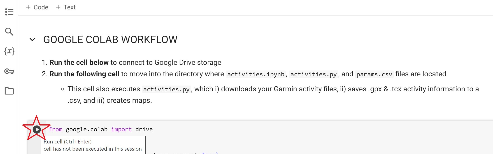

# Instructions to create maps from your Garmin Connect activity data

See an example of the three [map outputs](https://laurensharwood.github.io/): i) route heatmap, ii) 3D routes of a user input subset, and iii) a heatmap calendar of daily distance or ascent as a Github contributions graph.         

## <b>[Google Colab](https://colab.research.google.com/) Steps:</b>   
1. <b>Fill out</b>  your information in ```params.csv```   
2. <b>Upload</b> ```activities.ipynb```, ```activities.py```, and ```params.csv``` to the same folder in Google Drive
3. <b>To open</b> ```activities.ipynb``` in Google Drive:  
    * right-click ```activities.ipynb``` > Open With > Google Colaboratory  
4.  <b>To run a cell</b>:  
    * click inside the cell so the cursor is blinking, then press <i>ctrl+enter</i> or  <i>shift+enter</i>, or    
    * click that cell's arrow (see below)
5. <b>Enter your Garmin email & password when prompted</b> in code/executable cell #2, after packages are installed     


## Alternatively, create postgreSQL archive database (instead of saving as a .csv) and set a cron schedule on your Mac or Linux machine to automatically create maps:  

### Files: 
```params.csv```, ```activities.py```, & ```activities.sh``` must be in the same folder.   

```activities.sh```  <b>is called by cron</b>-- which has lines to activate a virtual environment (venv) with necessary packages installed, then execute ```activities.py``` from that active venv.     
```activities.py``` reads ***user input*** parameters from ```params.csv``` to:  
1. Download running and biking activities.  
2. If there are files to download, append files to archive <b>posgreSQL database</b>. 
3. If there are files to download, create maps. 

### PostgreSQL setup: Do once
<b>Create postgreSQL archive database</b> in psql
~~~
CREATE DATABASE garmin_activities; 
~~~

<b>Create postgreSQL archive tables</b> in Python
~~~
import psycopg2

table_column_dict = {
    ## activity foreign key lookup
    "activity_names":"(activity CHAR(14) PRIMARY KEY, activity_gpx CHAR(18) UNIQUE NOT NULL, activity_tcx CHAR(18) UNIQUE NOT NULL)" ,
    ## gpx waypoints 
    "gpx_runs": "(filename CHAR(18) REFERENCES activity_names (activity_gpx), date TIMESTAMP PRIMARY KEY, lat FLOAT NOT NULL, lon FLOAT NOT NULL, ele FLOAT NOT NULL, speed FLOAT NOT NULL)",
    "gpx_bikes": "(filename CHAR(18) REFERENCES activity_names (activity_gpx), date TIMESTAMP PRIMARY KEY, lat FLOAT NOT NULL, lon FLOAT NOT NULL, ele FLOAT NOT NULL, speed FLOAT NOT NULL)",
    ## tcx activity stats & tracks 
    "run_pts": "(date TIMESTAMP PRIMARY KEY, filename CHAR(18) REFERENCES activity_names (activity_tcx), lon FLOAT NOT NULL, lat FLOAT NOT NULL, distance FLOAT NOT NULL, elevation FLOAT NOT NULL, hr FLOAT, cadence FLOAT)",
    "bike_pts": "(date TIMESTAMP PRIMARY KEY, filename CHAR(18) REFERENCES activity_names (activity_tcx), lon FLOAT NOT NULL, lat FLOAT NOT NULL, distance FLOAT NOT NULL, elevation FLOAT NOT NULL, hr FLOAT)",
    "run_stats": "(filename CHAR(18) PRIMARY KEY REFERENCES activity_names (activity_tcx), start TIMESTAMP UNIQUE NOT NULL, distance FLOAT NOT NULL, duration FLOAT NOT NULL, ascent FLOAT NOT NULL, avg_speed FLOAT NOT NULL, hr_avg FLOAT, hr_max FLOAT)",
    "bike_stats": "(filename CHAR(18) PRIMARY KEY REFERENCES activity_names (activity_tcx), start TIMESTAMP UNIQUE NOT NULL, distance FLOAT NOT NULL, duration FLOAT NOT NULL, ascent FLOAT NOT NULL, avg_speed FLOAT NOT NULL, hr_avg FLOAT, hr_max FLOAT)",
}

for k in table_column_dict:
    conn = psycopg2.connect(database="garmin_activities", user="postgres", password="", host="localhost", port=5432)
    cur = conn.cursor()
    try:
        cur.execute("CREATE TABLE "+k+table_column_dict[k]+";")
    except (Exception, psycopg2.Error) as error:
        print("Error while fetching data from PostgreSQL: ", error)
    conn.commit() 
conn.close()
cur.close()
~~~


Launch psql terminal to create database or delete tables:   
> CREATE DATABASE garmin_activities;   
  
> DROP TABLE activity_names CASCADE;  
> DROP TABLE gpx_runs;  
> DROP TABLE gpx_bikes;  
> DROP TABLE run_pts;  
> DROP TABLE bike_pts;  
> DROP TABLE run_stats;  
> DROP TABLE bike_stats;  
 

### Cron setup: Do once

<b>Set execute permissions</b> for activities.sh and activities.py:    
~~~
chmod +x activities.py
chmod +x activities.sh
~~~

<b>Create cron task:</b>   
1. Enter ```crontab -e``` in your terminal    
2. Add a line specifying how often to execute a script:    
~~~
min hour day-of-month month day-of-week {command}  
~~~
ex) every day (```*``` == all) at 10:00am run activities.sh & don't send that email    
~~~
00 10 * * * ~/activities.sh >/dev/null 2>&1  
~~~
3. Save:
   * ctrl+X (to escape editing session)
   * Y (yes)
   * Enter     

5. Print active tasks: ```crontab -l``` to ensure it was created

