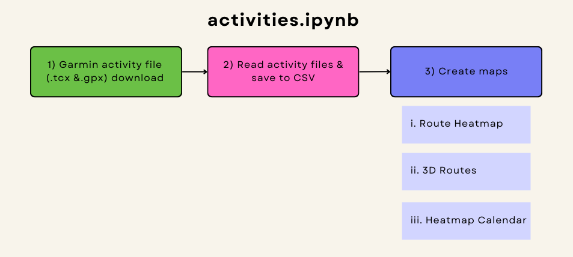

# Instructions to create maps of your Garmin Connect activity data 

Run ```activities.ipynb``` notebook from [Google Colab](https://colab.research.google.com/):       

* Upload ```activities.ipynb``` and ```activities.py``` to the same folder in Google Drive.
  * ```activities.ipynb``` imports functions, or uses code, from ```activities.py```.
* To open: right-click ```activities.ipynb``` > Open With > Google Colaboratory.
* To run a given cell: click that cell's arrow or select the cell then press <i>Shift+Enter</i>. 




See [example](https://laurensharwood.github.io/)        


# Automatically make maps of your routes using a cron schedule

## Files: 
```activities.sh```, ```activities.py```, and ```RUNfile.csv``` must be in the same folder   

```activities.sh```  <b>is called by cron</b>-- which has lines to activate a virtual environment (venv) with necessary packages installed, then execute ```activities.py``` from that active venv.     
```activities.py``` reads user input parameters from ```RUNfile.csv``` to:  
* download running and biking activities for <b>user input</b> number of days before today.  
If there are files to download:  
* appends files to archive csv  
* creates maps

## Setup steps: DO ONCE
<b>Save your Garmin login credentials</b> by entering the following commands in your terminal:   
~~~
export GARMIN_EMAIL = {your garmin username/email}
export GARMIN_PWD = {your garmin pwd}
~~~

<b>Set execute permissions</b> for get_garmin.sh and get_garmin.py:    
~~~
chmod +x get_garmin.py
chmod +x get_garmin.sh
~~~

<b>Create cron task:</b>   
1. Enter ```crontab -e``` in your terminal    
2. Add a line specifying how often to execute a script:    
~~~
min hour day-of-month month day-of-week {command}  
~~~
ex) every day (```*``` == all) at 10:00am run get_garmin.sh & don't send that email    
~~~
00 10 * * * ~/get_garmin.sh >/dev/null 2>&1  
~~~
3. Save:
   * ctrl+X (to escape editing session)
   * Y (yes)
   * Enter     

5. Print active tasks: ```crontab -l``` to ensure it was created

<b>Create postgreSQL archive database</b> in psql
~~~
CREATE DATABASE garmin_activities; 
~~~

<b>Create postgreSQL archive tables</b> in Python
~~~
import psycopg2

table_column_dict = {
    ## gpx waypoints 
    "gpx_runs": "(filename CHAR(18) NOT NULL, date TIMESTAMP NOT NULL, lat FLOAT NOT NULL, lon FLOAT NOT NULL, ele FLOAT NOT NULL, speed FLOAT NOT NULL)",
    "gpx_bikes": "(filename CHAR(18) NOT NULL, date TIMESTAMP NOT NULL, lat FLOAT NOT NULL, lon FLOAT NOT NULL, ele FLOAT NOT NULL, speed FLOAT NOT NULL)",
    ## tcx activity stats & tracks 
    "run_pts": "(date TIMESTAMP UNIQUE NOT NULL, filename CHAR(18) NOT NULL, lon FLOAT NOT NULL, lat FLOAT NOT NULL, distance FLOAT NOT NULL, elevation FLOAT NOT NULL, hr FLOAT, cadence FLOAT)",
    "bike_pts": "(date TIMESTAMP UNIQUE NOT NULL, filename CHAR(18) NOT NULL, lon FLOAT NOT NULL, lat FLOAT NOT NULL, distance FLOAT NOT NULL, elevation FLOAT NOT NULL, hr FLOAT)",
    "run_stats": "(filename CHAR(18) PRIMARY KEY NOT NULL, start TIMESTAMP UNIQUE NOT NULL, distance FLOAT NOT NULL, duration FLOAT NOT NULL, ascent FLOAT NOT NULL, avg_speed FLOAT NOT NULL, hr_avg FLOAT, hr_max FLOAT)",
    "bike_stats": "(filename CHAR(18) PRIMARY KEY NOT NULL, start TIMESTAMP UNIQUE NOT NULL, distance FLOAT NOT NULL, duration FLOAT NOT NULL, ascent FLOAT NOT NULL, avg_speed FLOAT NOT NULL, hr_avg FLOAT, hr_max FLOAT)",
}

for k in table_column_dict:
    conn = psycopg2.connect(database="garmin_activities", user="postgres", password="", host="localhost", port=5432)
    cur = conn.cursor()
    try:
        cur.execute("CREATE TABLE "+k+table_column_dict[k]+";")
    except (Exception, psycopg2.Error) as error:
        print("Error while fetching data from PostgreSQL: ", error)
    conn.commit() # <--- makes sure the change is shown in the database

conn.close()
cur.close()
~~~
